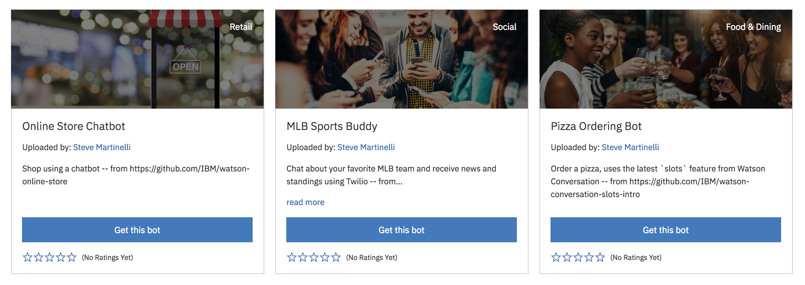
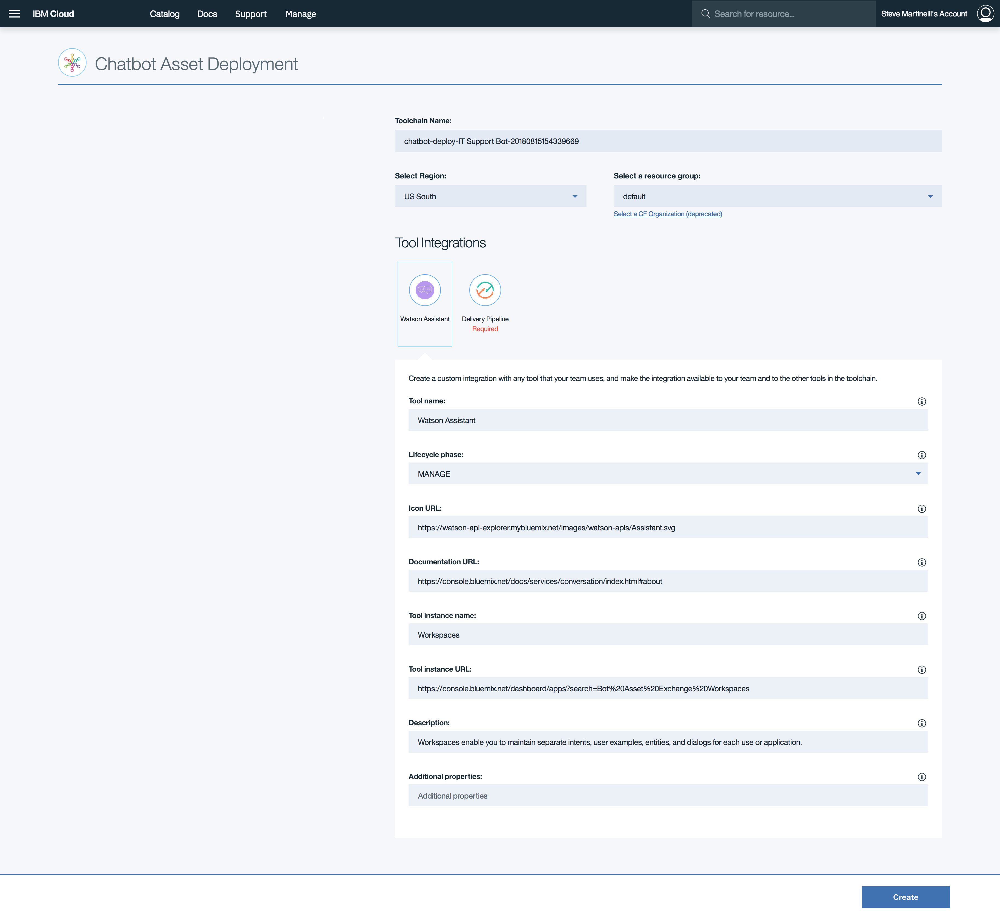
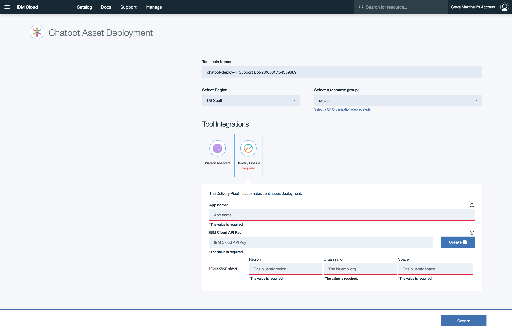
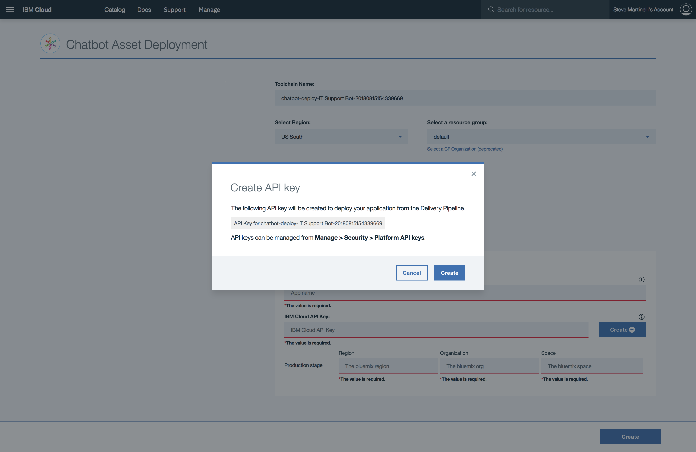
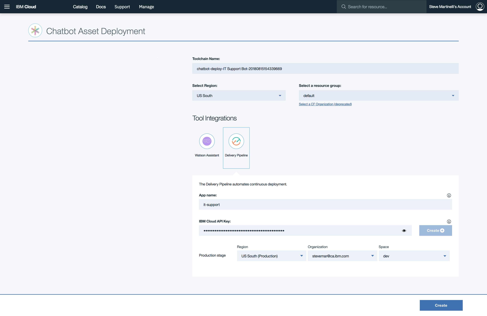
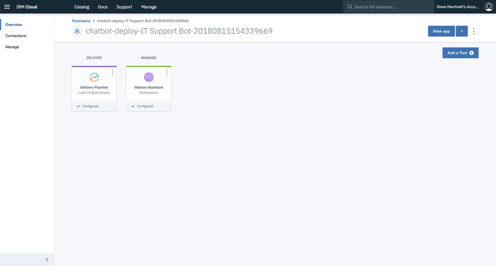
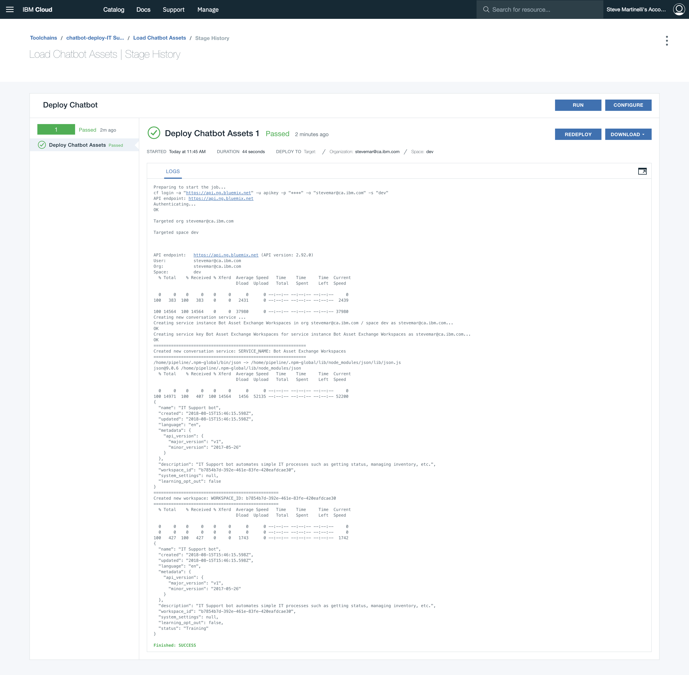
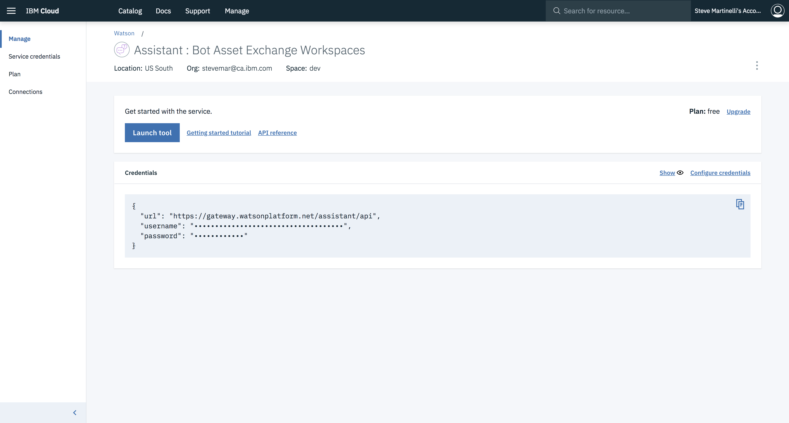
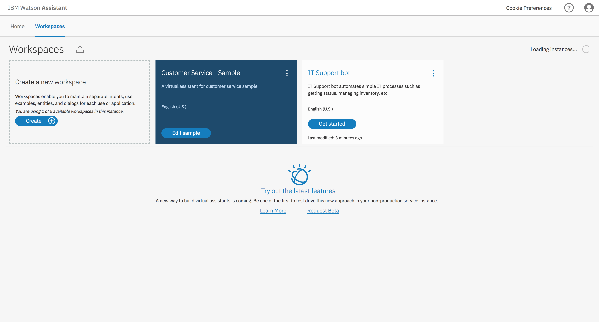

# IBM Cloud Pipeline based Chatbot Deployer

The chatbot deployer is an [IBM Cloud pipeline](https://console.bluemix.net/docs/services/ContinuousDelivery/pipeline_working.html#pipeline-working) plugin that is to be used in the new [Bot Asset Exchange](https://developer.ibm.com/code/exchanges/bots/).

### How do I use it?

1. Navigate over to the [Bot Asset Exchange](https://developer.ibm.com/code/exchanges/bots/) and click the `Deploy this bot` button.

   > NOTE: Alternatively you can click the `Get this bot` button to see the raw JSON content.

   

2. Log into IBM Cloud if prompted.

3. You'll be prompted to create a toolchain pipeline with a Watson Assistant service. Before clicking _Create_ we have to generate an API key.

   

4. Click on the _Delivery Pipeline_ icon.

   

5. Enter an application name and click on `Create (+)` to generate an API key. This should fill in the region information.

   

   _Now we're ready to deploy!_

   

6. Once the API key is generated you can _Create_ the toolchain, you'll be brought to an overview page.

   

7. Optionally, check the deployment log.

   

8. That's it! Now click the _Watson Assistant_ icon to see the new _Watson Assistant_ service (entitled `Bot Asset Exchange Workspaces`) that was just created.

   

9. Launch the _Watson Assistant_ service, find the workspace (the bot you picked!).

   

#### Here's an example:

> This is only slightly outdated

### What's it do?

Clicking the `Deploy this bot` button will:

* Create an IBM Cloud DevOps pipeline
* Create a _Watson Assistant_ service called `Bot Asset Exchange Workspaces`
* Upload the `workspace.json` file, which represents the bot you selected, into the newly created service

### Testing it out:

Underneath the covers, we hit the DevOps Service ``https://console.bluemix.net/devops/setup/deploy`` with three arguments:

1. URL escaped repository link, for example ``repository=https%3A%2F%2Fgithub.com%2FIBM%2Fchatbot-deployer``
2. Bot Name, for example ``chatbotName=Chatbot``
3. Workspace URL, for example: ``chatbotWorkspaceURL=chatbotWorkspaceURL=https%3A%2F%2Fgithub.com%2FIBM%2Fchatbot-deployer%2Fraw%2Fmaster%2Fdata%2Fworkspace.json``

Click [this link](https://console.bluemix.net/devops/setup/deploy?repository=https%3A%2F%2Fgithub.com%2FIBM%2Fchatbot-deployer&chatbotName=Chatbot&chatbotWorkspaceURL=https%3A%2F%2Fgithub.com%2FIBM%2Fchatbot-deployer%2Fraw%2Fmaster%2Fdata%2Fworkspace.json) to try it out.
